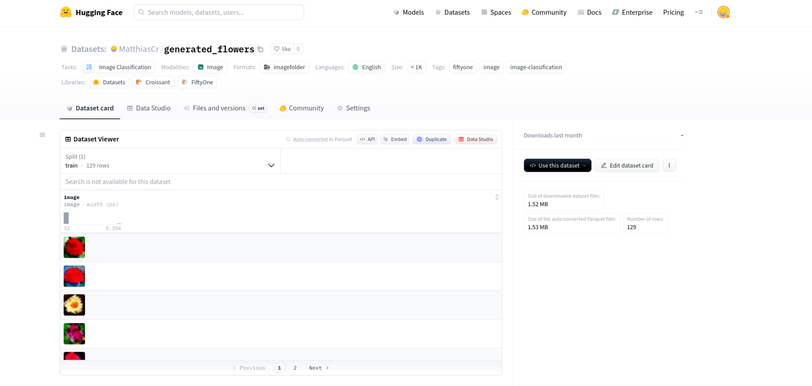
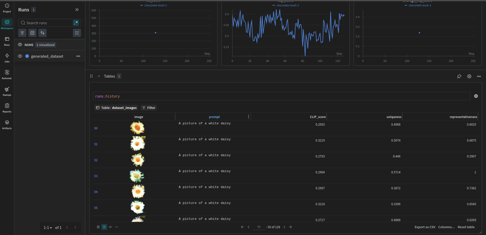

# Diffusion Models Assignment

This is an Assignment in the Seminar "Applied Hands-On Computer Vision" at HPI. It is about Denoising Diffusion Probabilistic Models (DDPM). The notebook uses a pretrained diffusion model to generate images of flowers. The weights for this model are stored in the [releases](https://github.com/MatthiasCr/Diffusion-Models-Assignment/releases/tag/v1) section of this repo. The notebook downloads and uses these weights automatically.

## Dataset of generated Images

The final dataset containing 128 generated images of flowers is uploaded to Huggingface:

[https://huggingface.co/datasets/MatthiasCr/generated_flowers](https://huggingface.co/datasets/MatthiasCr/generated_flowers)



## W&B Project

The generated images and all metrics and metadata is logged to the following Weights & Biases project:

[https://wandb.ai/matthiascr-hpi-team/diffusion_model_assessment](https://wandb.ai/matthiascr-hpi-team/diffusion_model_assessment)



## Running on Google Colab

The notebook can be executed in Google Colab.

<a target="_blank" href="https://colab.research.google.com/github/MatthiasCr/Diffusion-Models-Assignment/blob/main/diffusion_models_assignment.ipynb">
  
</a>

1. Open the notebook `diffusion_models_assignment.ipynb` in Colab by clicking the badge above.
    Execute the first cell in the notebook which contains:

```python
import sys

# Colab-only setup
if "google.colab" in sys.modules:
    print("Running in Google Colab. Setting up repo")

    !git clone https://github.com/MatthiasCr/Diffusion-Models-Assignment.git
    %cd Diffusion-Models-Assignment
```

This clones the repo and sets it as working directory. Now the code inside the `utils` directory can be used by the notebook.

2. **Huggingface Setup:** Set a `HF_TOKEN=<your_huggingface_token>` as Colab Secret so the notebook can load models and push the final dataset to huggingface.

3. **W&B Setup:** Set the constants `WANDB_TEAM_NAME` to your W&B team name and `WANDB_PROJECT_NAME` to a name for a (new) project. Execute the cell that contains `wandb.login()` and insert your W&B token
